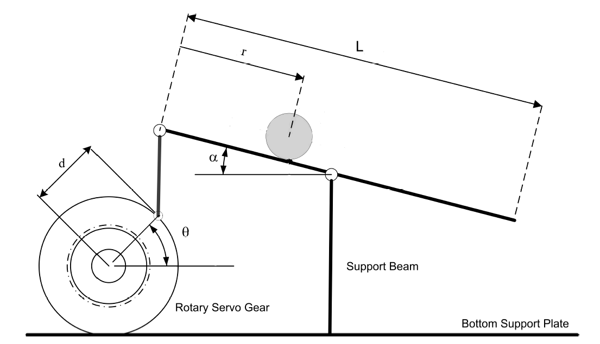
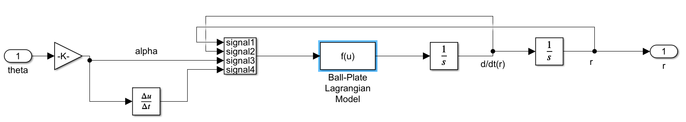
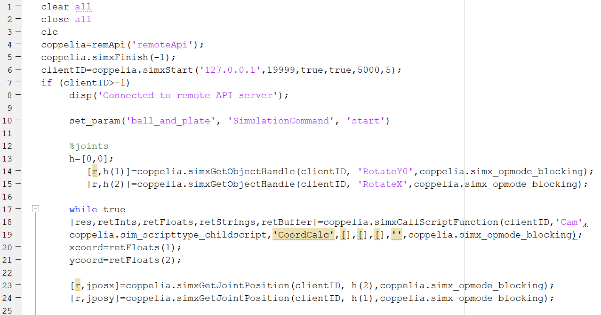
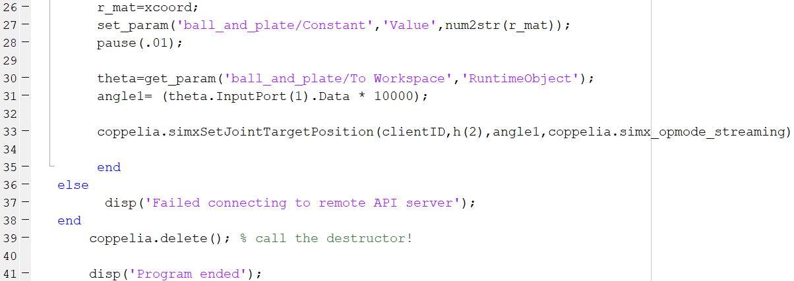

# Ball-and-Plate
Group: Nicholas Chenevey, Janette Calvillo Solis, Joseph Mount, Jason Fry, Jonathan Okokwo  
Sessions: 20  
## 1. Introduction  
Matlab and Simulink were used to designed a plate and motor system to keep a ball cenetered on the plate.

## 2. Modeling 
  
Figure 1. Image representing the Ball and Plate system  
 
The transfer function, Eq (), for one motor was found by taking the Laplace Transform of the equation of motion, Eq (). This same equation was used for the second motor.  
 
 
(Insert the equation of motion and the transfer function)

 
 
The design was done with the criteria of 5% overshoot and 5% settling time. (I JUST THROUGH IN THESE #'s) With this knowledge, Eq () and Eq() were used to find the natural frequency and damping ratio. 

Since Root Locus was used to design the controller the functiono rlocus(TF) was used in Matlab to obtain Figure (Insert the graph given my matlab) which displays the roots and poles of the transfer function. As shown in the figure, the system contains two pools on the imaginary axis and do not fall within the design requirements of a damping ration and natural frequency of 0.7 and 2.9 respectively. These values were found by using Eq() and Eq (). In order to solve this problem a lead controller was added to shift the the root locus to allow for the poles to fall within the criteria. The pole for the lead controller was selected to 0.01 to cancel the pole at the origin and the pole was selected to be 8 through trial since it was the number which shiften the root locus the most as shown in Figure ().  

(Insert the Figures mentioned above here)  

After these values were selected the gain was found by using the rlocfind function in matlab. As shown in Figure () the gain found through Matlab was k = 80.1815  

---NOTES TO ERASE-----
(IF the roots and poles of the newly selected values did not fall within the design region implement the Lead Controller eq and find the new roots and poles, select one pole of the lead controller that will cancel one of the original poles these selected values will go in Lead compensator in simulink) Then put it in matlab and make sure the root locus fit in design criteria. Look at michigan page and copy code into Matlab to find the gain and that's it.  
-----END OF NOTES-----
 
 
---- UPDATE SIMULINK WITH NEW #'S AND UPDATE THESE IMAGES----
  
Figure 2. Closed loop response

Figure 3. Inside the Ball and Plate block shown in Figure 1

## 3. Controller Design and Simulations

The controller was designed with  5% overshoot and 5% settling time with the use of Simulink and Matlab. Copelia was then used to create a simulation by communicating with Matlab and Simulink. Figure 4 demostartes the code used to create the simulations.

Figure 4. Matlab code to allow communication with Coppelia and SImulink

(Insert link to video of simulation)

## 4. Controller Implementation
Due to COVID-19, the team was unable to implement the code into a real system.
