# Ball-and-Plate
Group: Nicholas Chenevey, Janette Calvillo Solis, Joseph Mount, Jason Fry, Jonathan Okokwo  
Sessions: 30  
Hours: 100  
(The full report can be found under the Report and Presentation folder)
## 1. Introduction  
A controller for a ball and plate system must be designed using Matlab, Simulink and Coppelia. The system is to keep a ball balanced at the center of the plate and must react according to the ball’s position to avoid the ball from falling off the plate.

## 2. Modeling 
The Ball and Plate system being used is represented in Figure 1. The nonlinear equation of motion, Eq (1) was obtained using the diagram. Equations Eq (2) and Eq (3) were  also found through the geometry shown in the figure below.
  
Figure 1. Image representing the Ball and Plate system  
 

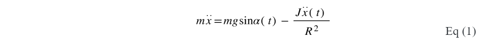  

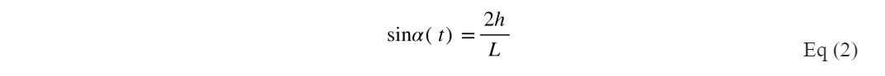  

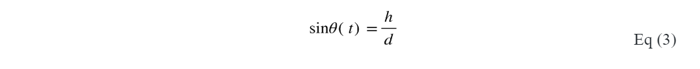  

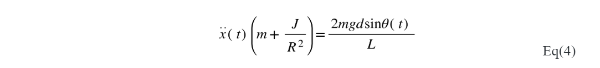  

 
The nonlinear equation of motion shown in Eq (4) was then linearized by sin(theta) = 0, thus, can be rewritten as  as shown in Eq (5). The transfer function, Eq (7), for one motor was then found by taking the Laplace Transform of the linearized equation, Eq (5).This transfer function equation was used for the second motor as well.  
 

  

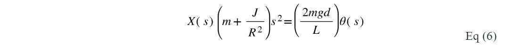  

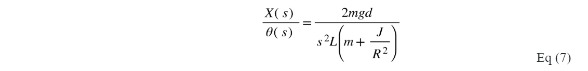  

 
 

## 3. Controller Design and Simulations

## 3.1 Controller
The design was done with the criteria of 5% overshoot and 4 seconds settling time. With this knowledge, Eq (4) and Eq(5) were used to find the natural frequency,wn, and damping ratio,𝜁. Since Root Locus was used to design the controller, the function rlocus(TF) was used in Matlab to obtain Figure (2), which displays the roots and poles of the transfer function. As shown in the figure, the system contains two poles on the imaginary axis that do not fall within the design requirements of a damping ratio and natural frequency of 0.7 and 1.45 respectively. In order to solve this problem a lead controller was added to shift the root locus allowing the poles to fall within the criteria. The pole for the lead controller was selected to be 0.01 to cancel the pole at the origin  and the pole was selected to be 4 through trial since it was the smallest number which shifted the root locus as shown in Figure (3).

  

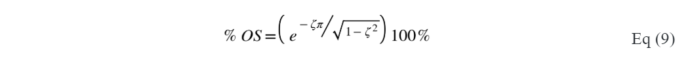  

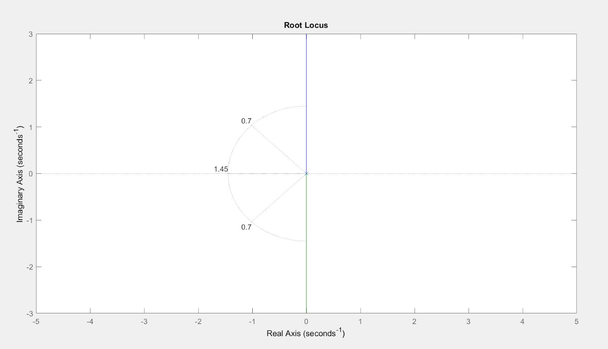
Figure 2. Poles are in the imaginary axis and not within design criteria  

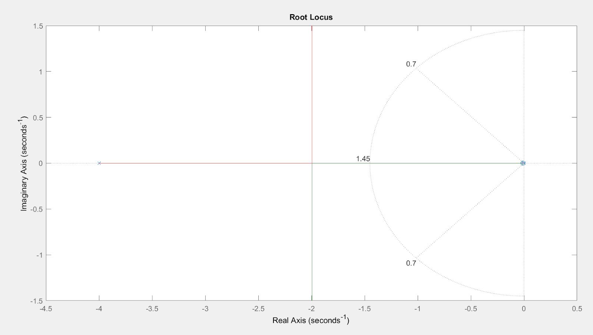
Figure 3. Poles are within design criteria after adding a Lead Controller  

After these values were selected the gain was found by using the rlocfind function in matlab. As shown in Figure (4) the gain found through Matlab was k = 9.9642  

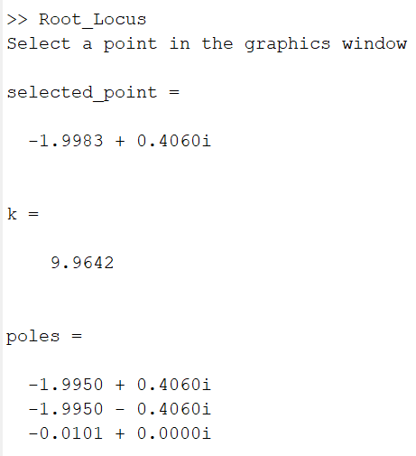  
Figure 4. Gain, k, given by the Matlab function rlocfind  

## 3.2 Simulink
Using Simulink, a mathematical model of the ball was developed for use in testing the lead compensator. Figure 5 shows the complete simulink block diagram, including the lead compensator and the ball and plate model. After using the lead compensator to produce a target angle, it is passed into the ball and plate model, shown in Figure 6,  for testing. The model simulates the ball’s position and outputs the expected position. Should the angle be correct, the position graph should stabilize at the originally targeted position. 
After using the mathematical model of the ball to test the effectiveness of the gain and lead compensator, the Ball and Plate Model block could be removed. The resulting block diagram is displayed in Figure 7. There are two separate resulting angles, one for the servo operating the X-axis and another for the servo operating the Y-axis. The first value is the desired coordinate, which then has the current coordinate of the ball subtracted from it. The resulting value is passed through the gain and lead compensator before being converted from degrees to radians. Finally, the resulting targeted angle is sent to the active MATLAB file. 

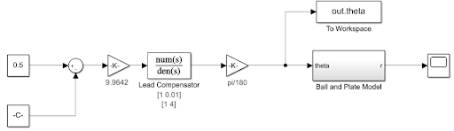  
Figure 5. Simulink model 
 

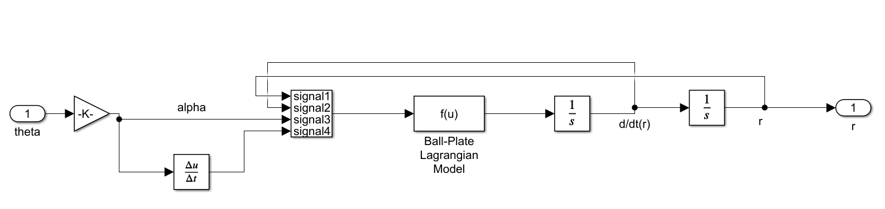
Figure 6. Inside the Ball and Plate block shown in Figure 5  

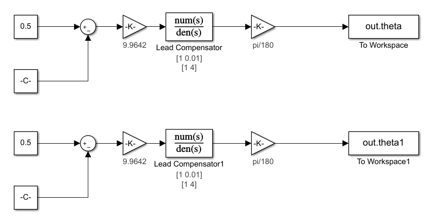
Figure 7. Ball and Plate Simulink Loop  
## 3.3 Coppelia and Matlab
Coppelia was then used with Matlab and Simulink to create a simulation using the Simulink models shown in Figure 4 and Figure 5. Figure 8 shows the code used by Coppelia to communicate the ball’s current coordinates to MATLAB while Figure 9 displays the code used in Matlab to communicate with Coppelia.

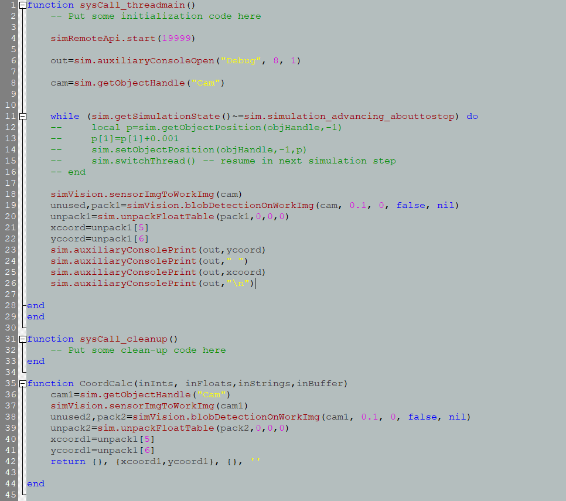
Figure 8. Coppelia Perspective Vision Sensor Threaded Code

The code within the while loop is used for testing purposes. The ball’s current coordinates are found using the vision sensor’s blob detection and then shown on a debug console. To use the coordinates within MATLAB, MATLAB calls the CoordCalc function and stores the returned values in new variables. 

Figure 9. Code used in Matlab to help Coppelia communicate with Simulink

(Insert link to video of simulation)

## 4. Controller Implementation
Due to COVID-19, the team was unable to implement the code into a real system.
