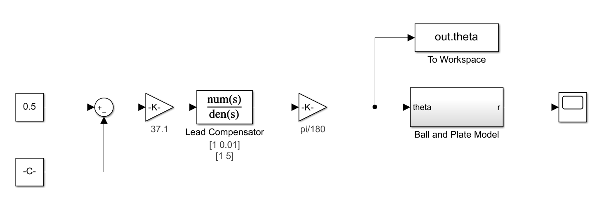

# Ball-and-Plate
Group: Nicholas Chenevey, Janette Calvillo Solis, Joseph Mount, Jason Fry, Jonathan Okokwo  
Sessions: 20  
## 1. Introduction  
Matlab and Simulink were used to designed a plate and motor system to keep a ball cenetered on the plate.

## 2. Modeling

  

## 3. Controller Design and Simulations

## 4. Controller Implementation
