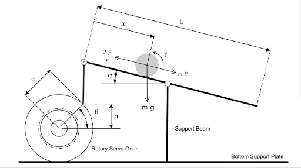

# Ball-and-Plate
Group: Nicholas Chenevey, Janette Calvillo Solis, Joseph Mount, Jason Fry, Jonathan Okokwo  
Sessions: 30  
Hours: 75  
## 1. Introduction  
A controller for a ball and plate system must be designed using Matlab, Simulink and Coppelia. The system is to keep a ball balanced at the center of the plate and must react according to the ball’s position to avoid the ball from falling off the plate.

 

 
## 2. Modeling 
The Ball and Plate system being used is represented in Figure 1. The nonlinear equation of motion, Eq (1) was obtained using the diagram. Equations Eq (2) and Eq (3) were  also found through the geometry shown in the figure below.
  
Figure 1. Image representing the Ball and Plate system  
 
The nonlinear equation of motion shown in Eq (4) was then linearized by = 0, thus, can be rewritten as  as shown in Eq (5). The transfer function, Eq (7), for one motor was then found by taking the Laplace Transform of the linearized equation, Eq (5)..This transfer function equation was used for the second motor as well.  
 
 
(Insert the equation of motion and the transfer function)

 
 
The design was done with the criteria of 5% overshoot and 4% settling time. (I JUST THROUGH IN THESE #'s) With this knowledge, Eq () and Eq() were used to find the natural frequency and damping ratio. 

Since Root Locus was used to design the controller the function rlocus(TF) was used in Matlab to obtain Figure (Insert the graph given my matlab) which displays the roots and poles of the transfer function. As shown in the figure, the system contains two pools on the imaginary axis and do not fall within the design requirements of a damping ratio and natural frequency of 0.7 and 1.45 respectively. These values were found by using Eq() and Eq (). In order to solve this problem a lead controller was added to shift the the root locus to allow for the poles to fall within the criteria. The pole for the lead controller was selected to be 0.01 to cancel the pole at the origin and the pole was selected to be 4 through trial since it was the number which shiften the root locus the most as shown in Figure ().  
## 3. Controller Design and Simulations
The design was done with the criteria of 5% overshoot and 4% settling time. With this knowledge, Eq (4) and Eq(5) were used to find the natural frequency,wn, and damping ratio,𝜁.
Since Root Locus was used to design the controller, the function rlocus(TF) was used in Matlab to obtain Figure (2), which displays the roots and poles of the transfer function. As shown in the figure, the system contains two poles on the imaginary axis that do not fall within the design requirements of a damping ratio and natural frequency of 0.7 and 1.45 respectively. In order to solve this problem a lead controller was added to shift the root locus allowing the poles to fall within the criteria. The pole for the lead controller was selected to be 0.01 to cancel the pole at the origin  and the pole was selected to be 4 through trial since it was the smallest number which shifted the root locus as shown in Figure (3).

      Eq ()  
                                          
          Eq()  

(Insert the Figures mentioned above here)  

 
 
---- UPDATE SIMULINK WITH NEW #'S AND UPDATE THESE IMAGES----
  
Figure 2. Closed loop response

Figure 3. Inside the Ball and Plate block shown in Figure 1

## 3. Controller Design and Simulations

The controller was designed with  5% overshoot and 5% settling time with the use of Simulink and Matlab. Copelia was then used to create a simulation by communicating with Matlab and Simulink. Figure 4 demostartes the code used to create the simulations.

Figure 4. Matlab code to allow communication with Coppelia and SImulink

(Insert link to video of simulation)

## 4. Controller Implementation
Due to COVID-19, the team was unable to implement the code into a real system.
