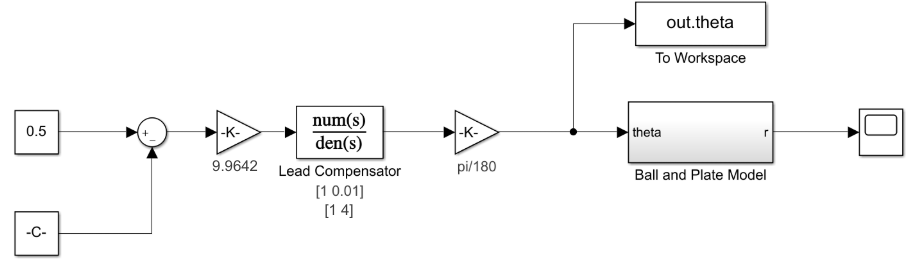

# Ball-and-Plate
Group: Nicholas Chenevey, Janette Calvillo Solis, Joseph Mount, Jason Fry, Jonathan Okokwo  
Sessions: 20  
## 1. Introduction  
Matlab and Simulink were used to designed a plate and motor system to keep a ball cenetered on the plate.

## 2. Modeling

(Insert the equation of motion and the transfer function)

  
Figure 1. Closed lope response

Figure 2. The direct model of our nonlinear equation of motion

## 3. Controller Design and Simulations
The controller was designed with the use of Simulink and Matlab. Copelia was then used to create a simulation by communicating with Matlab and Simulink. Figure _ demostartes the code used to create the simulations.

clear all
close all
clc
coppelia=remApi('remoteApi');
coppelia.simxFinish(-1);
clientID=coppelia.simxStart('127.0.0.1',19999,true,true,5000,5);
if (clientID>-1)  
     disp('Connected to remote API server');
     
     set_param('ball_and_beam', 'SimulationCommand', 'start') 
    
     %joints
     h=[0,0];
        [r,h(1)]=coppelia.simxGetObjectHandle(clientID, 'RotateY0',coppelia.simx_opmode_blocking);
        [r,h(2)]=coppelia.simxGetObjectHandle(clientID, 'RotateX',coppelia.simx_opmode_blocking);
       
     while true
     [res,retInts,retFloats,retStrings,retBuffer]=coppelia.simxCallScriptFunction(clientID,'Cam',coppelia.sim_scripttype_childscript,'CoordCalc',[],[],[],'',coppelia.simx_opmode_blocking);
     xcoord=retFloats(1);
     ycoord=retFloats(2);
     
     [r,jposx]=coppelia.simxGetJointPosition(clientID, h(2),coppelia.simx_opmode_blocking);
     [r,jposy]=coppelia.simxGetJointPosition(clientID, h(1),coppelia.simx_opmode_blocking);
     
     r_mat=xcoord;
     set_param('ball_and_plate/Constant','Value',num2str(r_mat));
     pause(.01);
    
     theta=get_param('ball_and_plate/To Workspace','RuntimeObject');
     angle1= (theta.InputPort(1).Data * 10000);
    
     coppelia.simxSetJointTargetPosition(clientID,h(2),angle1,coppelia.simx_opmode_streaming)
     
     end
else
      disp('Failed connecting to remote API server');
end
    coppelia.delete(); % call the destructor!
    
    disp('Program ended');

(Insert link to video of simulation)

## 4. Controller Implementation
Due to COVID-19, the team was unable to implement the code into a real system.
